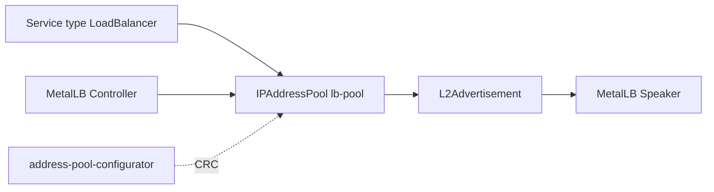

# MetalLB GitOps

MetalLB Operator e configuração de `LoadBalancer` declarativos para
OpenShift/Kubernetes. O perfil de desenvolvimento é compatível com
OpenShift Local/CRC e calcula dinamicamente a faixa de IPs a partir da rede do
nó local.

## Arquitetura



O MetalLB fornece IP externo para Services `LoadBalancer` em clusters que não
possuem load balancer de nuvem. No CRC, o Job `address-pool-configurator`
descobre a rede local e ajusta o `IPAddressPool`; em aceite/produção, use uma
faixa reservada e documentada no IPAM.

## Como funciona no CRC

O `IPAddressPool` da base usa uma faixa segura de documentação como placeholder.
No overlay local, o Job `address-pool-configurator` roda após a criação do CR e
patcha o pool para `${prefixo-do-node}.200-${prefixo-do-node}.250`. Isso torna o
deploy portável entre máquinas com CRC sem gravar IP fixo no Git.

O Argo CD ignora o drift apenas em `/spec/addresses` do `IPAddressPool`, porque
esse campo é calculado em runtime no CRC. Os demais campos continuam gerenciados
por GitOps.

## Deploy

Este repositório é consumido pelo app-of-apps do `argocd-gitops`. Para aplicar
manualmente em laboratório:

```bash
oc apply -k overlays/desenvolvimento
```

Para ambientes não locais, revise o `IPAddressPool.spec.addresses` antes de
sincronizar:

```bash
oc kustomize overlays/aceite >/tmp/metallb-aceite.yaml
oc kustomize overlays/producao >/tmp/metallb-prod.yaml
```

## Estrutura

```text
base/                         namespaces, OLM, MetalLB CR, pool e anúncio L2
overlays/desenvolvimento/     perfil CRC com configuração automática do pool
overlays/aceite/              homologação com placeholders para faixa reservada
overlays/producao/            produção com placeholders para faixa reservada
docs/                         documentação operacional por ambiente
```

## Validação

```bash
oc -n metallb-system get pods
oc -n metallb-system get metallb,ipaddresspools,l2advertisements
oc get svc -A --field-selector spec.type=LoadBalancer
```

Um Service `LoadBalancer` deve receber um `EXTERNAL-IP` dentro da faixa
configurada no `IPAddressPool`.

## Segurança e operação

- reserve a faixa de IPs fora do DHCP;
- mantenha a faixa documentada no IPAM do ambiente;
- evite compartilhar a mesma faixa entre clusters;
- o Job de ajuste possui Role namespace-scoped com permissão apenas de
  `get/patch` no `IPAddressPool` `lb-pool`;
- revise permissões do Argo CD e do Operator antes de produção;
- valide ARP/NDP e conectividade L2 na rede local;
- use mais de um nó em produção para alta disponibilidade real do speaker.

## Secrets

Nenhum Secret é requerido por este repositório. As entradas específicas por
ambiente são faixas de IP reservadas e devem ficar documentadas no IPAM, não em
Secrets.

## Ambientes e validação

```bash
oc kustomize overlays/desenvolvimento >/tmp/metallb-dev.yaml
oc kustomize overlays/aceite >/tmp/metallb-aceite.yaml
oc kustomize overlays/producao >/tmp/metallb-prod.yaml
oc apply --dry-run=client -k overlays/desenvolvimento
```

A base usa range RFC 5737 como placeholder. No CRC, o Job
`address-pool-configurator` calcula o prefixo a partir do IP do nó. Em aceite e
produção, substitua `IPAddressPool.spec.addresses` por faixa reservada do
ambiente e documente no IPAM. Veja `docs/AMBIENTES.md`.

## Referências

- [MetalLB Operator no OperatorHub](https://operatorhub.io/operator/metallb-operator)
- [Documentação oficial do MetalLB](https://metallb.universe.tf/)
